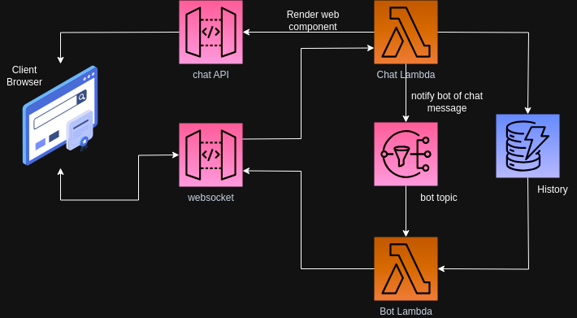

<p align="center"><a href="https://nitric.io" target="_blank"></a></p>

## Nitric Chatbot Component Example

This is a [Nitric](https://nitric.io) TypeScript project, that implements a Chat webcomponent using LitElement, websockets and GPT-4.

## Running this project locally

Ensure dependencies are installed

```bash
# install dependencies
yarn install

# run locally
yarn dev dev
```

## Learning Nitric

Nitric provides detailed and intuitive [documentation](https://nitric.io/docs) and [guides](https://nitric.io/docs/getting-started) to help you get started quickly.

If you'd rather chat with the maintainers or community, come and join our [Discord](https://discord.gg/Webemece5C) server, [GitHub Discussions](https://github.com/nitrictech/nitric/discussions) or find us on [Twitter](https://twitter.com/nitric_io).

## Running this project

To run this project you'll need the [Nitric CLI](https://nitric.io/docs/installation) installed, then you can use the CLI commands to run, build or deploy the project.

You'll also want to make sure the project's required dependencies have been installed.

Setup your .env variables:

```bash
cp .env.template .env
```

and fill in with your own API keys e.g.

```env
OPENAI_API_KEY=YOUR_OPEN_AI_KEY
```


```bash
# install dependencies
npm install

# run locally
npm run dev
```

## Deploying this project

This project can easily be deployed to AWS simply run:

```bash
nitric stack new
```

select AWS and complete the prompts.

Then run:
```bash
nitric up
```

This will deploy the following resources:



## Integratining into a website

The example app has a minimal intregration example for local development
```html
<html>
    <head>
        <script type="module" src="http://localhost:4001/"></script>
    </head>
    <body>
        <chat-element></chat-element>
    </body>
</html>
```

Once your API has been deployed you can simply replace the local API with your deployed API hostname.